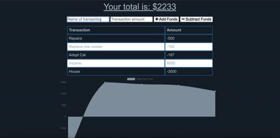

# The_Progressive_Budget
  

## Table of Contents 
* [Description](#Descritpion)
* [Installation](#Installation)
* [Usage](#Usage)
* [Tests](#Tests)
* [Credits](#Credits)
* [License](#License)
* [Contact Information](#ContactInfo)

## Description
This progressive budget tracker allows the user to add expenses and deposits to their budget with or without a connection. When entering transactions offline, it populate the total when brought back online.

## Installation 

No installation required to run application. 

However, 

To clone program's repo, run the following command line in your terminal/git bash: 

`git@github.com:ifeasome/The_Progressive_Budget.git`. 

To view repo, go to: [Application Repo](https://github.com/ifeasome/The_Progressive_Budget).

## Usage 
GIVEN a user is on Budget App without an internet connection, it still enaables the user to input a withdrawal or deposit
that will be shown on the page, and added to their transaction history when their connection is back online.

[Deployed App](https://stormy-headland-99972.herokuapp.com/)

## Tests 
Install program as detailed here: [Installation](#Installation). 

App Functionality  

## License

 
 
© 2020 Somelina Obiechina

## Contact Information 
For questions, queries or anything at all, contact me at: 

Github: [https://github.com/ifeasome](https://github.com/ifeasome) 

Email: [ifeasome@gmail.com](ifeasome@gmail.com)

